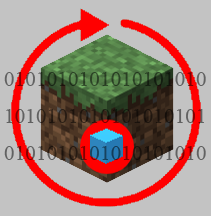

# MBCS 皮肤材质包生成器



这是一个可以生成 Minecraft 皮肤材质包的程序

## Table of Contents

- [Install](#install)
- [Usage](#usage)
- [Maintainers](#maintainers)
- [License](#license)

## Install

```
直接在releases或mcbbs下载即可使用
```

## Usage

```
在程序中填写填写信息，点击“生成材质包”按钮即可
源代码运行方式：bash中输入：
npm install
npm run
```

## Maintainers

[@WzhDnwzWzh](https://github.com/WzhDnwzWzh)
Minecraft Byte Cube Studio 工作室

## License

MIT © 2020 Minecraft Byte Cube Studio
